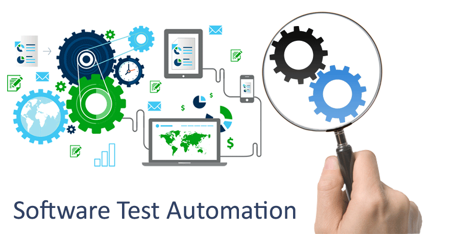
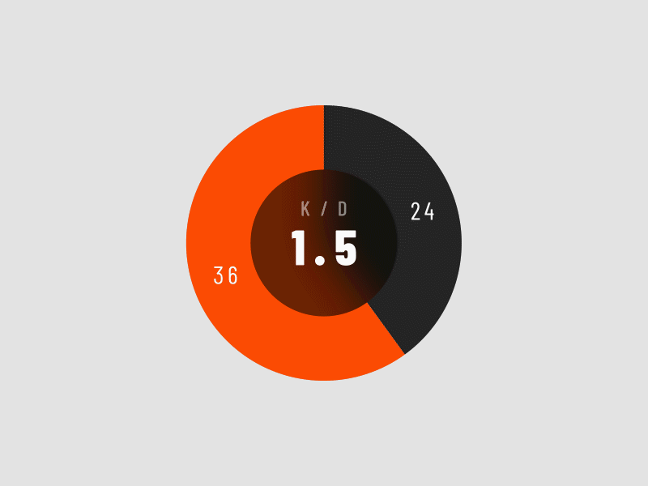

# shivani

   

# Shivani Sri S R's GitHub Portfolio

Hello! I'm Shivani Sri S R, a passionate and determined computer science student currently pursuing a Bachelor's degree at S.A Engineering College. I am enthusiastic, self-motivated, and equipped with strong interpersonal skills.

## About Me

- 🎓 Bachelor's degree in Computer Science from S.A Engineering College.
- 💡 Enthusiastic, self-motivated, and determined fresher.
- 👥 Strong interpersonal skills.
- 🌐 Seeking job opportunities to contribute innovative ideas and skills to an esteemed organization.

## Projects

### Automation for Adactin Hotel Application

Developed and executed a comprehensive automation framework for the Adactin Hotel Application. This streamlined testing processes, improved reliability, and enhanced software quality.

- Duration: 2023 – Present

### [Book Shop Online](PROJECT-LINK)

Building a web application for a book shop using HTML, CSS, and JavaScript. Utilizing Visual Studio Code as the development environment.

- Date: 11/2022

## Skills

- Programming Languages: C, Java
- Web Technologies: HTML, CSS
- Tools: Microsoft Word, Excel, PowerPoint
- UI & UX Design
- Version Control: Git
- IDE: Visual Studio Code

## Contact Information

- Email: shivanisri2306@gmail.com
- Phone: 9884890213
- Address: No: 559/1, 22nd Cross Street, Shenoy Nagar T.P Chathiram, Chennai-30
- Date of Birth: 23/06/2003

## Certificates

- [HTML Essential Training](Certificate-Link)
  - Issued by LinkedIn Learning, Online

- [Java Programming](Certificate-Link)
  - Issued by Great Learning Academy

- [SQL and Relational Databases 101](Certificate-Link)
  - Issued by Cognitive Class.ai, IBM

## Languages

- English
- Tamil

## Interpersonal Skills

- Communication skills
- Leadership skills
- Project Management skills
- Time management

Feel free to reach out to me for any collaboration or opportunities. Thank you!

---

**Note**: Replace placeholders like `[PROJECT-LINK](project-link-url)` and `[Certificate-Link](certificate-link-url)` with actual project and certificate links.

## 🌐 Socials:
  
 

    

# 💻 Tech Stack:
   
# 📊 GitHub Stats:
 
 

---

<!-- Proudly created with GPRM ( https://gprm.itsvg.in ) -->
